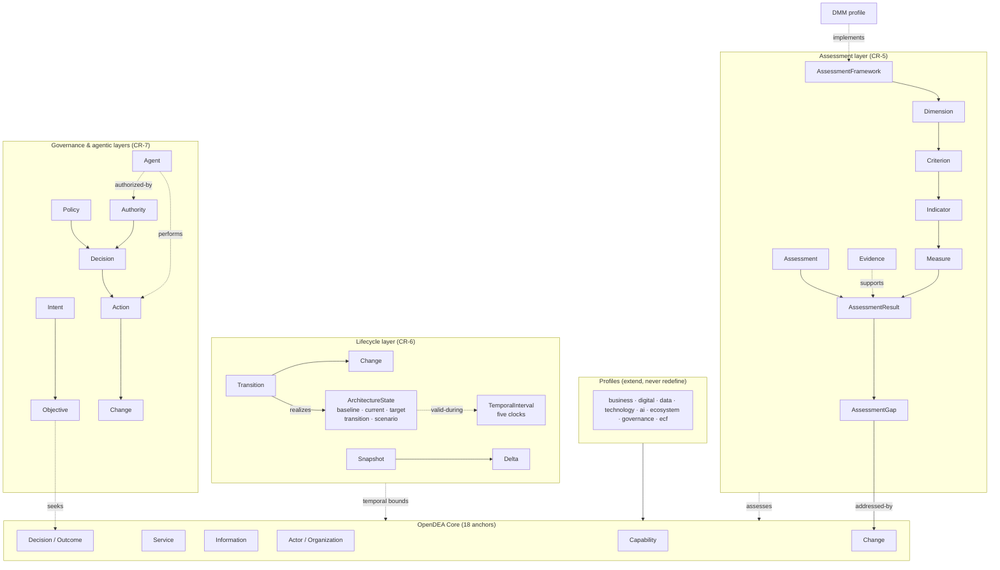

# OpenDEA Metamodel — Open Digital Enterprise Architecture Metamodel

> **Canonical entity definitions, relationships, and schemas for all DEA catalog repositories.**

[](./VERSION)
[](https://github.com/technehub-labs/dea-architecture-framework/tree/v0.5.0)
[](./schemas/)
[](./ttl/)

## Overview

The DEA Metamodel is the **foundation layer** for the TechneHub Labs Enterprise Architecture space.
Every entity, relationship, and attribute used across all `dea-catalog-*` repositories is defined here
and referenced by version pin.

```
dea-metamodel (this repo)
       ↑
       │ version-pinned by all catalog repos
       │
   ┌───┴───────────────────────────────────────┐
   │  dea-catalog-tenets                       │
   │  dea-catalog-patterns                     │
   │  dea-catalog-guardrails                   │
   │  dea-catalog-blueprints                   │
   │  dea-catalog-metrics                      │
   │  dea-catalog-ontologies                   │
   │  dea-catalog-concepts                     │
   └───────────────────────────────────────────┘
```

## Normative / Derived / Informative (CR-1)

**There is one normative semantic model. Everything else is a representation,
projection, serialization, implementation, or visualization of that model.**

> The canonical DEA metamodel is defined by the normative metamodel specification
> (`metamodel/dea-metamodel.yaml`). All schemas, database structures, viewer graphs,
> documentation diagrams and other representations MUST be generated from or validated
> against the normative specification.

| Class | Content | Authority |
|---|---|---|
| **Normative** | `metamodel/dea-metamodel.yaml`, `metamodel/manifest.yaml`, `metamodel/registry/` | The semantic metamodel — the only source of truth |
| **Derived** | `schemas/`, `sqlite/`, `typescript/`, `pydantic/`, `ttl/`, `viewer/entity-graph.json`, `viewer/metamodel.svg` | Generated from or validated against the normative model — never edited to change semantics |
| **Informative** | `docs/` narratives, `examples/`, diagrams, tutorials | Illustration only — no semantic authority |

Change control: every metamodel modification requires a CR in [`change-requests/`](./change-requests/)
following [`docs/versioning.md`](./docs/versioning.md). The CR-1.6 semantic expansion
freeze held through CR-003 and is now lifted — new entity types enter via the CR
process and CR-4's core-ontology consolidation.

## Structure

```
dea-metamodel/
├── metamodel/                 # NORMATIVE — dea-metamodel.yaml, manifest.yaml, registry/
├── change-requests/           # CR-based change control
├── docs/                      # architecture.md · semantics.md · temporal-semantics.md · governance-agentic-semantics.md · specification-and-conformance.md · runtime-architecture.md · versioning.md
├── specification/             # CR-8: the formal OpenDEA 1.0 specification (+ generated inventory/vocabulary/catalogues)
├── tools/                     # CR-8: opendea_validate.py — reference conformance validator
├── models/                    # CR-8: golden/ (must pass) + invalid/ (must fail for the expected rule)
├── mappings/                  # CR-8: external standard mappings (ArchiMate; DMN evaluated)
├── visualization/             # CR-8: presentation profile — viewers consume, never define
├── runtime/                   # CR-9: reference runtime — GraphStore, model loader, service API
├── tests/conformance/         # Conformance suite (runs in CI)
├── tests/runtime/             # CR-9: runtime suite — graph contract, loader, CRUD, provenance/temporal
├── VERSION                    # == metamodel version (CI-enforced)
├── CHANGELOG.md
├── metamodel.yaml             # LEGACY index (deprecated v0.6.0 — kept for compatibility)
├── schemas/                   # DERIVED — per-entity JSON Schema definitions
├── ttl/                       # DERIVED — OWL/RDF Turtle serializations
├── sqlite/                    # DERIVED — SQLite runtime projection
├── typescript/                # DERIVED — TypeScript interfaces
├── pydantic/                  # DERIVED — Python Pydantic models
└── viewer/                    # DERIVED — entity graph + rendered diagram
```

## Semantic IDs

Every normative entity and relationship carries a stable identifier
(`dea:BusinessCapability`, `dea:realizes`) — display names are labels, never identifiers.
The authoritative inventory is [`metamodel/registry/`](./metamodel/registry/). See
[`docs/semantics.md`](./docs/semantics.md) for ID conventions, the canonical relationship
ontology (CR-2), and lifecycle states.

## Core Ontology & Profiles (CR-4)

**OpenDEA Core defines stable semantic concepts; OpenDEA Profiles define specialized
architectural viewpoints and frameworks.**

- [`metamodel/core/`](./metamodel/core/) — 18 anchors (Entity, Actor, Organization,
  Capability, Behavior, Service, Resource, Information, Decision, Outcome, Requirement,
  Constraint, Change, …) + the 25-type core relationship grammar + O001–O009 constraints
- [`metamodel/profiles/`](./metamodel/profiles/) — 10 profiles (business, ecosystem,
  digital, data, technology, ai, governance, assessment, dmm, ecf) with explicit
  `depends_on` declarations; profiles extend Core, never redefine it

Core can be explained without mentioning DMM, ECF, ArchiMate, AI, cloud, any industry,
or any vendor. DMM is an assessment lens over the semantic graph, not part of the Core.

## Design rationale — the CR programme

Every structural decision in this repository traces to a numbered Change Request in
[`change-requests/`](./change-requests/). The rationale matters as much as the artefact:
readers should be able to see *why* the ontology is shaped the way it is.

| CR | Rationale (why) | Consequence (what you see here) |
|---|---|---|
| [CR-001](./change-requests/CR-001.md) | Scattered, divergent copies of the model made every consumer guess which was true. | One normative source (`metamodel/dea-metamodel.yaml`); everything else derived, version-pinned, drift-tested in CI. |
| [CR-002](./change-requests/CR-002.md) | Untyped, directionless relationships made the graph semantically ambiguous. | A typed, directed, inverse-aware relationship ontology with cardinality, temporality and provenance. |
| [CR-003](./change-requests/CR-003.md) | Relationship state duplicated on entities always drifted from the relationship store. | Entities carry no relationship state; canonical relationship instances are authoritative. |
| [CR-004](./change-requests/CR-004.md) | Without a stable core, every framework (DMM, ECF, ArchiMate) leaked into the base vocabulary. | 18-anchor Core + 10 profiles with `depends_on`; profiles extend, never redefine (O001–O009). |
| [CR-005](./change-requests/CR-005.md) | `capability.maturity = 3` conflates *what the enterprise is* with *how it is assessed* — one entity, one score, one framework, no evidence, no history. | A separate assessment layer: maturity belongs to frameworks, results carry evidence/confidence/provenance, and gaps connect to Change. |
| [CR-006](./change-requests/CR-006.md) | "Application A exists" and "A existed in 2024 / is planned for 2027 / was retired" collapsed into one static catalogue entry. Architecture is a *time-dependent state*, not a catalogue. | Five clocks (transaction/valid/observation/planned/effective); lifecycle states and events; Baseline/Current/Target/Transition/Scenario states; snapshots, deltas, version chains; planned ≠ actual; history never overwritten (T001–T010). |
| [CR-007](./change-requests/CR-007.md) | The graph knew *what/when/how mature* but not *why a change is desired, who may decide it, what constrains it, what evidence informs it* — "agentic EA" was degenerating into an agent inventory. | The causal/governance layer: Intent → Objective → Policy → Decision → Action → Change → Outcome → Evidence → reassessment. Authority ≠ capability; autonomy is not a boolean; agents are participants, not the center (G001–G016). |
| [CR-008](./change-requests/CR-008.md) | A rich metamodel is not a standard: two independent implementations could reach different conclusions about the same model. | **OpenDEA 1.0** — the consolidation into a formal specification: frozen Core, canonical vocabulary, envelope schema, reference validator, golden/negative model contract, conformance levels 0–5, generated documentation. See [`specification/`](./specification/OpenDEA-Semantic-Architecture-Specification.md). |
| [CR-009](./change-requests/CR-009.md) | A specification without a runtime is a language nobody speaks: the model could be *validated* but not *executed* — no graph, no ingestion, no reasoning, no agent interaction, no closed loop. | **OpenDEA Runtime** — a semantic operating layer: vendor-independent `GraphStore`, canonical model loader (validate → atomic load), provenance/temporal-retaining graph, registry-validated CRUD, Assertion → Evidence → Source provenance chains with explicit approval transitions, governed rule registry and levelled explainable inference that materializes only as PROPOSED assertions, bitemporal temporal queries, event envelope and event log, frozen snapshots and structural diff for drift. Invariants: no silent inference (CR-9CQ), no autonomous mutation by default (CR-9CR). Milestones CR-9.1–9.10; CR-9.1/9.2/9.3/9.4/9.10a/9.10b/9.5/9.6/9.7/9.8/9.9 + CR-10 Phases 1/2/3/4/5 implemented. See [`runtime/`](./runtime/README.md) + [`docs/runtime-architecture.md`](./docs/runtime-architecture.md). |
| [CR-010](./change-requests/CR-010.md) | Runtime state that cannot be questioned is a snapshot, not a decision platform: "what if?" and "what should we do?" were unanswerable without mutating the live enterprise state. | **Scenario & Decision Intelligence** — scenarios as first-class semantic objects: immutable baselines + explicit deltas (ADD…SCALE), explicit assumptions/constraints/outcomes with uncertainty classes, simulated state isolated from production, frozen evaluated versions, reproducibility hashes, impact graphs with direct/indirect dependency paths, architecture deltas, explicit impact valence, semantic metrics, weighted criteria, decomposable scores, ranking and explainable recommendations that never become approved decisions. Plus the documentation consolidation: [conceptual architecture](./docs/opendea-conceptual-architecture.md), [ADRs](./docs/adr/README.md), [glossary](./docs/glossary.md). Phases 1–3 implemented; Phases 4–7 queued. See [`docs/concepts/scenario.md`](./docs/concepts/scenario.md). |
| [CR-011](./change-requests/CR-011.md) | Enterprise knowledge lives in CMDBs, EA repos, ITSM, GRC, DMM assessments and SaaS platforms — without a formal interoperability architecture, every integration would distort the canonical model. | **Interoperability & Federation** — adapters absorb external complexity. First-class ExternalSystem / IntegrationAdapter (connector ≠ adapter) / SemanticMapping (relationship + confidence + lossiness, governed and versioned) / ExternalIdentifier (correlated, never adopted) / Exchange envelope / `EntityResolution` with full reconciliation states / `KnowledgeConflict` preservation / property-specific `AuthorityPolicy`. Extensions stay namespaced, never Core (ADR-013). Phases 1–2 implemented; Phases 3–8 queued. See [`docs/interoperability/`](./docs/interoperability/overview.md). |
### The ontology in one picture



### The CR-5 closed loop

What the enterprise **is** (Core) and how it is **assessed** (profiles) are different
semantic layers. The same Capability can be assessed by DMM, an AI-readiness model and
a cyber framework at different dates and scopes — without conflict, because maturity lives
on the `AssessmentResult`, never on the entity (rule A008, enforced in CI):

```
Describe → Assess → Identify Gap → Decide → Transform → Measure → Reassess
(Core)   (Result)  (derived Gap)  (Decision) (Change)   (Measure)  (new Baseline)
```

## Diagram Design Tokens

The rendered metamodel diagram (`viewer/metamodel.svg`) follows a locked
design defined in **`viewer/diagram-tokens.json`** — no canvas (transparent
background inheriting the page), dark layer-colored packages, small italic
relationship labels with no outline, light-grey attribute text on dark entity
fills.

Every regeneration consumes these tokens: `generate_puml.py` (PlantUML skin
params) and `inject_svg_attributes.py` (SVG post-processing) load them via
`.github/scripts/diagram_tokens.py`. Do not hardcode design values in the
pipeline scripts.

Per-layer accent/dark colors are **not** in the token file — they cascade
from the OpenDEAM root model through `viewer/entity-graph.json`
(`layers[].color` / `layers[].dark_color`), so new layers and packages pick
up color coding automatically. Extend the token file (e.g. the `dimension`
tokens) only when adding a new cross-cutting dimension.

## Quick Start

### Validate an entity against the metamodel

```bash
# Validate a JSON entity
python3 scripts/validate_entity.py --schema schemas/entities/tenet.json --entity my-tenet.json

# Validate RDF serialization
python3 scripts/validate_rdf.py --schema ttl/dea-metamodel.ttl --input my-entity.ttl
```

### Run the conformance suite

```bash
python3 -m pytest tests/conformance/ -v
```

### Query the SQLite runtime store

```bash
sqlite3 sqlite/dea-metamodel.db ".schema"
sqlite3 sqlite/dea-metamodel.db "SELECT * FROM entities WHERE type = 'ArchitecturePattern';"
```

### Generate TypeScript types

```bash
cd typescript && npm install && npm run generate
```

## Versioning Policy

Full policy: [`docs/versioning.md`](./docs/versioning.md). Summary:

- **MAJOR** — breaking semantic changes (entity/relationship removal or redefinition,
  inheritance change, incompatible cardinality)
- **MINOR** — backward-compatible additions (new entity/relationship, optional attribute)
- **PATCH** — non-semantic corrections (docs, formatting, regenerated artifacts)
- **Changing a relationship's definition is a semantic change even when the JSON schema
  stays compatible.**
- Catalog repos pin to a **specific tag** (e.g., `v0.6.0`) in their `metamodel-pointer.yaml`

## Contributing

1. Open a Change Request record under `change-requests/` (see `change-requests/README.md`)
2. Submit a PR against the **normative source** (`metamodel/dea-metamodel.yaml`) — never
   against derived artifacts
3. CI validates: JSON Schema valid, TTL parses, SQLite schema applies, TypeScript compiles,
   **conformance suite passes, no version/semantic drift**
4. CODEOWNERS (platform-architecture team) must approve

## License

Apache 2.0 — see [LICENSE](./LICENSE).
